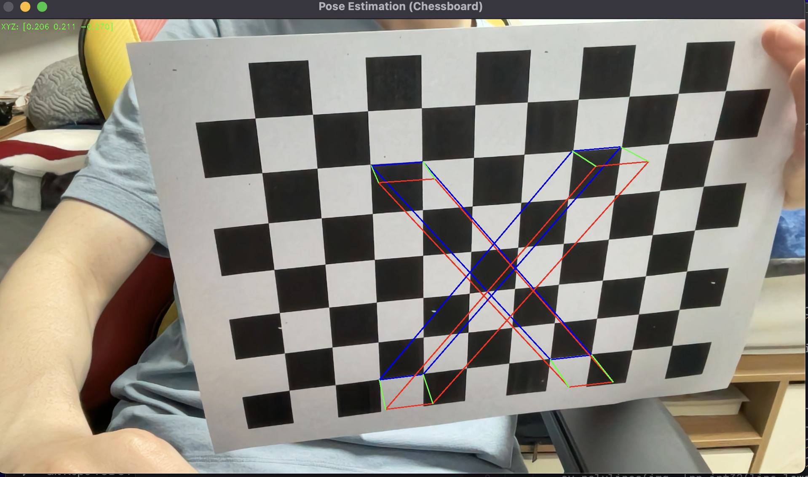
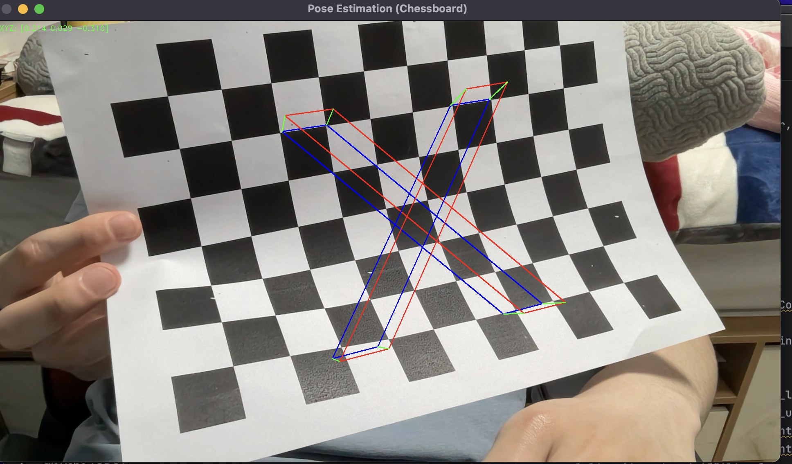

# camera-calibration-ar
ARchess is a project that showcases the capabilities of OpenCV for camera calibration and augmented reality. 

---
## Requirements
- Python 3.x
- OpenCV 4.x

---
## Usage
1. Clone this repository or download the source code.
2. Open a terminal or command prompt and navigate to the project directory.
3. Run the following command to calibrate your camera using a chessboard pattern:

```bash
python camera_calibration.py
```

4. take a picture of a chessboard pattern with spacebar and save it with Enter
5. When you are done, press ESC to exit the program.
6. Copy the calibration parameters to the `pose_estimation_chessboard.py` file.
7. Run the following command to estimate the pose of the chessboard:
 
```bash
python pose_estimation_chessboard.py
```

8. Press ESC to exit the program.
---


## Screenshots




